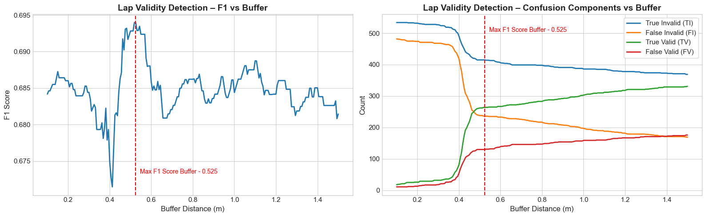

# ApexRacing

**A data-driven analysis of telemetry-based performance in F1 simulation racing, investigating optimal behavioural car metrics through Turns 1 and 2 of Melbourne Albert Park circuit.**

---

## 1. Project Description  

Performances in motorsports are dictated by a range of key factors regarding the braking, turning and throttle of the vehicle, where each plays a critical role in determining the final lap time. Often shaped by the split-second decisions made by drivers at specific sections of the track, turns are one such crucial point as they present opportunities for overtaking. As even microsecond differences can dictate differences in these outcomes, minimising the time required to pass through these zones becomes essential, especially in competitive contexts such as Formula One races.

Previous research on optimal driving strategies has often relied on simple simulations or narrow datasets. In this project, we analyse a **Formula One simulation** with a high-resolution dataset capturing vehicle behaviour through Turns 1 and 2 at the Melbourne Albert Park circuit. Our primary aim is to determine the optimum behavioural car conditions (i.e. braking, throttle, steering) at which the vehicle exits Turn 2, based on the time to reach a fixed distance point.

The setup involves acquiring multiple reference datasets describing the race circuit and lap performance. The proposed final dataframe integrates these into engineered lap-level features, capturing key performance indicators (braking point, throttle point, etc) alongside aggregated measures (e.g. total throttle applied within defined segments). to further complement the evaluation of performances. These tasks highlight a significant initial step in bridging the gap between model driven optimisation and real world telemetry analysis in the modern motorsport landscape.

---

## 2. Dataset  

### 2.1 Sources  

Our project uses several **Jupyter Notebooks** for analysis and visualization, and **Python files** for building the complete dataset.  

Data sources include:  

- **UNSW F12024**: large-scale dataset of F1 racing lap performance  
- **f1sim-ref-left**: left track boundaries  
- **f1sim-ref-right**: right track boundaries  
- **f1sim-ref-turns**: corner and apex reference points  
- **f1sim-ref-line**: ideal racing line  

### 2.2 Data Description  

#### 2.2.1 Final Data Product Description

The final data product is a lap-level dataset, with each row representing a single lap attempted by a driver (~500–1000 rows total). Features summarise key aspects of lap execution (e.g. braking, throttle, steering, speed, and segment-based performance), aligned to track geometry and specific race segments. The dataset is designed to capture both overall lap characteristics and driver–track interactions, with the target variable being lap time (or sector time for the focus region of Turns 1–3).

- **Observations (rows):** one per lap, across all drivers (~500–1000 total)
- **Features (columns):** engineered summaries of braking, throttle, steering, speed, and sector performance
- **Target variable:** lap time at a point, 900m (See section 3.5.3)
- **Usage:** compare driver performance, model lap outcomes, and evaluate optimal racing strategies

*(TODO - TABLE OF FEATURES)*
The final feature set was informed by exploratory data analysis, literature review, and domain expertise provided by Stuart

---

#### 2.2.2 Incoming and Cleaned Data Description

The incoming telemetry contains frame-level observations of driver and vehicle state (speed, throttle, steering, braking, gear, RPM, world position, lap/sector times). These raw data are cleaned, synchronised, and aligned with the track, then aggregated into lap-level summaries that form the basis of the final dataset.

- **Observations (rows):** vehicle state at each recorded frame/step of the lap
- **Features (columns):** raw telemetry (speed, throttle, steering, braking, gear, RPM, position, times)
- **Target variable:** not defined at frame level; derived later through aggregation into lap/sector time
- **Usage:** preprocessed and aggregated to generate lap-level summaries for the final dataset

| Description                | Variables                                                                                                                                | Features               | Usage                                                                                    |
| ----------------------------- | ---------------------------------------------------------------------------------------------------------------------------------------- | ---------------------- | ---------------------------------------------------------------------------------------- |
| **Session Identifiers**       | `SESSION_GUID`, `M_SESSIONUID`, `R_SESSION`, `R_NAME`, `R_STATUS`, `M_TRACKID`                                                           | Categorical/Text       | Groups laps/runs; links telemetry to results/metadata; filters by track/session context |
| **Lap Data**                  | `M_CURRENTLAPNUM`, `M_CURRENTLAPNUM_1`, `M_CURRENTLAPINVALID_1`, `LAPTIME`, `CURRENTLAPTIME`, `M_CURRENTLAPTIMEINMS_1`                   | Discrete/Binary/Time   | Lap segmentation, filtering invalid laps, and benchmarking performance                  |
| **Driver Inputs**             | `M_THROTTLE_1`, `M_BRAKE_1`, `M_STEER_1`, `M_GEAR_1`, `M_FRONTWHEELSANGLE`, `M_DRS_1`                                                    | Continuous/Categorical | Evaluates acceleration, braking, cornering, gear shifts, and DRS use                    |
| **Speed & Engine**            | `M_SPEED_1`, `M_ENGINERPM_1`                                                                                                             | Continuous             | Core performance measures; assess acceleration, straight-line speed, and shift points   |
| **Brake Temperatures**        | `M_BRAKESTEMPERATURE_FL_1`, `M_BRAKESTEMPERATURE_FR_1`, `M_BRAKESTEMPERATURE_RL_1`, `M_BRAKESTEMPERATURE_RR_1`                           | Continuous (°C)        | Thermal load and braking efficiency; detects imbalance/overheating                      |
| **Tyre Pressures**            | `M_TYRESPRESSURE_FL_1`, `M_TYRESPRESSURE_FR_1`, `M_TYRESPRESSURE_RL_1`, `M_TYRESPRESSURE_RR_1`                                           | Continuous (psi/kPa)   | Grip and stability; monitors balance and traction                                       |
| **Distances**                 | `M_LAPDISTANCE_1`, `M_TOTALDISTANCE_1`                                                                                                   | Continuous (m)         | Aligns telemetry with track position; cumulative mileage tracking                       |
| **World Position (Car)**      | `M_WORLDPOSITIONX_1`, `M_WORLDPOSITIONY_1`, `M_WORLDPOSITIONZ_1`                                                                         | Continuous             | 3D trajectory mapping for racing line, elevation, and kerbs                             |
| **World Orientation Vectors** | `M_WORLDFORWARDDIRX_1`, `M_WORLDFORWARDDIRY_1`, `M_WORLDFORWARDDIRZ_1`, `M_WORLDRIGHTDIRX_1`, `M_WORLDRIGHTDIRY_1`, `M_WORLDRIGHTDIRZ_1` | Continuous             | Car heading/orientation in 3D space; used in angle-to-apex, yaw/roll calculations       |
| **Car Angles**                | `M_YAW_1`, `M_PITCH_1`, `M_ROLL_1`                                                                                                       | Continuous (degrees)   | Captures rotation dynamics - heading, dive/squat, and body roll                         |
| **Track Reference Data**      | `FRAME`, `WORLDPOSX`, `WORLDPOSY`, `APEX_X1`, `APEX_Y1`, `CORNER_X1…Y2`, `TURN`                                                          | Mixed                  | Defines track geometry, apex points, corners, and reference frames                      |
| **Engineered Features**       | `dist_apex_1`, `dist_apex_2`, `angle_to_apex1`, `angle_to_apex2`, `track_width`, `left_dist`, `right_dist`, `l_width`, `r_width`, `in`   | Continuous/Binary      | Derived metrics for racing line, corner approach, and track usage evaluation            |

### 2.3 Assumptions  

- **Baseline assumptions:** derived from client consultation (Stuart, Oracle)
  - Current **f1sim-ref-line** ideal racing line is not indicative of fastest possible route for each driver (Stuart)  
- **Data cleaning assumptions:**  
  - Remove irrelevant tracks  
  - Remove NaNs in car coordinates  
  <!-- - Filter slower drivers (>75th percentile until Turn 3)   -->

---

## 3. Workflow  

The workflow for this project:  

### 3.1. Data acquisition  

We began by ingesting multiple reference raw datasets that describe the Albert Park circuit:

- The left and right track boundaries (*f1sim-ref-left.csv, f1sim-ref-right.csv*)
- A refrence racing line (*f1sim-ref-line.csv*)
- Apex point data and area for each corner (*f1sim-ref-turns*).

 These were combined with the UNSW F1 2024 lap telemetry dataset (UNSW F12024.csv), which contains detailed information about driver inputs (throttle, braking, steering) and car dynamics (speed, gear, RPM, position).  

### 3.2. Data and Cleaning

We began by cleaning the data, first removing unnecessary columns and renaming the remaining columns for clarity. The dataset also contained laps from tracks that were not part of our analysis (see figure ?).  

|  |
|:--:|
| *Figure 1. Number of data points per track, with approximate track ID layouts.* |

We therefore removed all data from tracks other than Albert Park, and further excluded datapoints beyond Turn 3, since our focus is on Turns 1 and 2 and the overtaking section between Turns 2 and 3. This was done by filtering for laps with a current lap distance below 1200m.  

Finally, we performed checks to handle missing values in the dataset, primarily for the car position variables. Rows with missing coordinates totaled around 68,000

Futher laps were removed as dicussed in the *Removing unsuitable laps* section.

### 3.3. Track visualisation  

To verify the data and provide context for later analysis, we reconstructed the circuit by plotting the left and right boundaries alongside the refrence racing line. Apex points were overlaid, and corners were annotated. We then produced zoomed-in visualisations of Turns 1 and 2, since these form the core section of interest.  

|  |
|:--:|
| *Figure 2. Number of data points per track, with approximate track ID layouts.* |

Should we add the sample turns?

### 3.4. Removing unsuitable laps

- Removing rows with less than N (to be determined) data points so features could be constructed cleanly
- Removing laps where lap max distance between points become too great -> inaccuracy

### 3.5. Feature engineering  

#### 3.5.1 Track Width

We calculated the track width at each point along the circuit as a new feature. Using the reference datasets for the left and right track boundaries, we computed the Euclidean distance between corresponding points on each side of the track.  

This feature serves two purposes:  

1. It provides a spatial context for the car’s position along the track.  
2. It is used in off-track detection by comparing a car’s perpendicular distance from the track edges against the track width plus a buffer representing half the car’s width.  

|  |
| :-: |
| *Figure 3. Track width near corner (TODO - Index to be replaced with distance)* |

#### 3.5.2 Off track

To identify when cars went off track, we calculated each car’s perpendicular distance from both the left and right track boundaries and summed these distances. If the total distance exceeded the width of the track at that point, plus a buffer accounting for the car’s width, the car was considered off track.  

Since the provided coordinates do not account for the car’s physical width, we needed to choose an appropriate buffer. The dataset included an `INVALID_LAP` flag indicating whether the car went off track at any point in the lap. We used this flag to test different buffer values and selected the one that maximized the F1 score (Balancing false positives and false negatives) representing what is most likley the same buffer width used in the races / game simulation.

|  |
| :-: |
| *Figure 4. Comparison of predicted lap validity (buffer-based) against official lap invalid flags across different buffer distances*|

#### 3.5.3 Target distance

We choose the target lap distance 900 to be the point where we determine drivers’ time. Since we used linear interpolation of lap distance covered to determine when the driver reaches the target lap distance, the most accurate section between turn 2 and 3 for us to consider for the target lap distance would be the latter half. The reasoning is that the rate of change in acceleration and speed during the exit from turn 2 would be high which in turn would result in the rate of change in lap distance to also be high causing uneven distances between measurement points. This would lead to a less accurate linear interpolation result relative to the latter half since the rate of change in acceleration and speed plateaus and thus results in more even distances between measurement points improving the accuracy of the linear interpolation. We also plotted a brake vs lap distance plot for our subset of drivers and found that majority of drivers begin braking for turn 3 around the lap distance 950. To ensure that our interpolation function does not get influenced by the braking and distances between measurement points, we choose the target lap distance to be 900.

It is also to note that by choosing a later point, rather than just after Turn 2, we optimise two objectives simultaneously: maximising exit speed from the corner and minimising the elapsed time to complete the run into Turn 3. This works because exit speed and segment time are inherently linked, so optimising the target point jointly improves both objectives simultaneously.

**(TO DO - CODE )**
We constructed new features to capture driver behaviour and vehicle dynamics more explicitly. These include braking and acceleration zones, steering angles, and measures of cornering precision. Each feature was designed as a separate transformation so that the pipeline can flexibly add or remove features depending on modelling needs.  

### Analysis and modelling (planned)  

Our next step is to evaluate driver performance through Turns 1–3, comparing how different inputs (braking, throttle, steering) impact lap time / speed / **(TO DO - THEORY)**.

---

## 4. Project Status  

### 4.1 Planning & Research  

- Conducted literature review on driver behavior, braking/throttle strategies, and racing simulations  
- Identified limitations in existing studies  

### 4.2 Dataset Construction  

- Interpreted dataset structure  
- Visualized variables and circuit geometry  
- Cleaned data (removed off-track laps, NaNs, and slowest drivers)  

### 4.3 Next Steps  

- Finalize feature engineering  
- Develop and test models for driver performance analysis  
- Evaluate results and compare across drivers  

---

## 5. Usage  

This product is intended for:  

- Analysis of driver performance in key track sections  
- Exploration of braking/acceleration patterns  
- Simulation of optimal racing strategies  

Future work may include:  

- Adding derived features (e.g., braking zones, acceleration windows)  
- Integrating external racing telemetry datasets  
- Building interactive simulations  

---

## 6. Contributors  

- **Data Transformation:** Charlotte Fang Hendro, Christian Joel, Eric Kim, Muhammad Ijaz, Samuel Katz  
- **Data Source:** Oracle – Stuart Coggins  
- **Guidance & Education:** Dr Jakub Stoklosa  

If you’d like to contribute:  

- Explore additional factors influencing lap time  
- Generate new features from existing data  
- Build simulations to test strategies  
- Integrate external datasets  

---

## 7. Support  

For questions or suggestions, contact:  

- Charlotte Fang Hendro – <z5363431@ad.unsw.edu.au>  
- Christian Joel – <z5257354@ad.unsw.edu.au>  
- Eric Kim – <z5478624@ad.unsw.edu.au>  
- Muhammad Ijaz – <z5417537@ad.unsw.edu.au>  
- Samuel Katz – <z5479193@ad.unsw.edu.au>  

---

